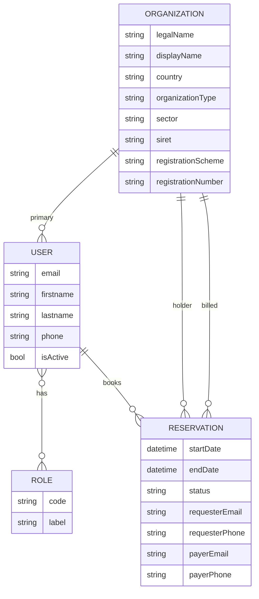
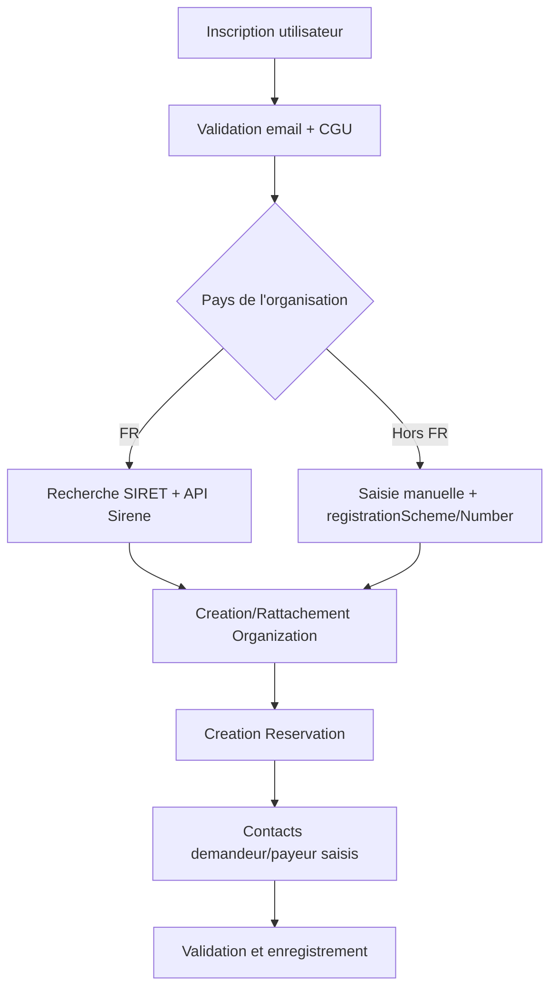

# Stratégie de gestion des usagers

## 1. Objectifs et périmètre

Cette documentation définit la **stratégie de modélisation et de gestion des usagers** de l’application de réservation de salles.

Elle vise à :
- distinguer clairement les **personnes physiques** (comptes utilisateurs) et les **structures juridiques** (associations, entreprises, collectivités, CD08, structures étrangères) ;
- permettre la réservation de salles par des usagers internes ou externes ;
- couvrir les besoins métiers en matière de **demandeur**, **payeur** et **facturation** ;
- garantir une **sécurisation de l’inscription** et une traçabilité des données ;
- anticiper les évolutions (facturation complexe, structures étrangères, rôles multiples).

---

## 2. Principes directeurs

### 2.1. Un seul compte utilisateur

Il n’existe **qu’une seule entité technique de compte** :

- un usager est un **User**,
- qu’il soit agent CD08, membre d’une association ou représentant d’une entreprise,
- la distinction s’opère via :
  - les rôles de sécurité,
  - le rattachement à une structure (`Organization`).

> Il n’existe pas d’entité `Usager` distincte de `User`.

---

### 2.2. Séparation stricte Personne / Structure

- **User** : représente une **personne physique** qui se connecte.
- **Organization** : représente une **structure juridique** (porteuse ou facturée).
- **Reservation** : représente un **acte métier** reliant un utilisateur à une ou plusieurs structures.

Cette séparation est essentielle pour :
- la facturation,
- l’historisation,
- la gestion multi-structures,
- l’ouverture à l’international.

---

## 3. Modélisation des entités

### 3.1. User (compte utilisateur)

Représente la **personne qui se connecte à l’application**.

#### Responsabilités
- Authentification / sécurité
- Identité personnelle
- Coordonnées de contact
- Acceptation des conditions d’utilisation

#### Champs principaux

- email (identifiant de connexion)
- mot de passe (haché)
- civilité (optionnel)
- nom
- prénom
- fonction / poste (optionnel)
- service / direction (optionnel, surtout pour CD08)
- téléphone
- rôles (`ROLE_CUSTOMER`, rôles backoffice…)
- acceptation des CGU / charte d’utilisation

#### Rattachement structurel

- Un utilisateur peut être rattaché à **une organisation principale** (`organization`).
- Ce rattachement sert :
  - au préremplissage des réservations,
  - à la cohérence métier,
  - sans enfermer les cas plus complexes (facturation distincte).

---

### 3.2. Organization (structure)

Représente une **entité juridique ou administrative**.

#### Exemples
- Association
- Entreprise
- Service du CD08
- Collectivité
- Structure étrangère (ex. belge)

#### Champs métier

- pays (`Country`, obligatoire)
- type de structure :
  - ASSOCIATION
  - ENTREPRISE
  - COLLECTIVITE
  - CD08_SERVICE
  - AUTRE
- secteur : PUBLIC / PRIVE
- dénomination légale
- dénomination personnalisée (nom d’usage)
- adresse postale (embeddable `Address`)

#### Identifiants légaux

**France (si pays = FR)** :
- SIRET
- SIREN
- RNA (associations)
- code NAF / APE

**Étranger (si pays ≠ FR)** :
- `registrationScheme` (ex. BE_BCE, FOREIGN_REGISTRY)
- `registrationNumber`
- numéro de TVA (optionnel)

> Le SIRET n’est jamais obligatoire hors France.

#### Source de données

- `source = SIRENE` (données issues de l’API Sirene)
- `source = MANUEL` (saisie manuelle)

---

### 3.3. Reservation (acte métier)

Représente une **demande de réservation de salle**.

#### Liens structurants

- `booker` → User  
  (compte ayant effectué la demande)
- `holderOrganization` → Organization  
  (structure pour laquelle la salle est réservée)
- `billedOrganization` → Organization  
  (structure facturée)

Par défaut :
- `billedOrganization = holderOrganization`
- La distinction est possible si le métier l’autorise.

---

#### Contacts métier associés à la réservation

La réservation porte les **coordonnées nominatives** demandées par le métier.

##### Contact Demandeur
- civilité
- fonction
- nom
- prénom
- email (obligatoire)
- téléphone (obligatoire)

##### Contact Payeur
- civilité
- fonction
- nom
- prénom
- email (obligatoire)
- téléphone (obligatoire)

> Ces informations sont **stockées sur la réservation** afin de conserver un instantané historique, indépendamment de l’évolution des comptes utilisateurs.

---

## 4. Parcours de création et sécurisation de l’inscription

### 4.1. Création de compte utilisateur

La sécurisation de l’inscription repose sur :

- email valide (unique)
- mot de passe conforme aux recommandations CNIL
- acceptation des CGU / charte d’utilisation
- éventuellement validation par lien email

Ces éléments relèvent exclusivement de l’entité **User**.

---

### 4.2. Création ou rattachement à une structure

Lors de la première réservation ou lors de l’inscription :

- si pays = France :
  - saisie ou recherche par SIRET,
  - appel API Sirene,
  - création ou rattachement à une `Organization`.
- si pays ≠ France :
  - saisie manuelle des champs,
  - utilisation de `registrationScheme` / `registrationNumber`.

---

## 5. Règles métier clés

1. Un **User** est toujours une personne physique.
2. Une **Organization** est toujours une structure juridique.
3. Une réservation référence :
   - un demandeur,
   - un payeur,
   - une structure porteuse,
   - une structure facturée.
4. Les contacts demandeur / payeur sont **propres à chaque réservation**.
5. Le SIRET est :
   - autorisé et exploité uniquement pour la France,
   - ignoré pour les structures étrangères.

---

## 6. Rôles et permissions

### 6.1. Rôles applicatifs

Les rôles sont portés par `User` et pilotent l’accès aux parcours.

Rôles minimums recommandés :
- `ROLE_CUSTOMER` : usager externe (associations, entreprises, collectivités).
- `ROLE_AGENT` : agent CD08 (instruction, gestion interne).
- `ROLE_ADMIN` : administration fonctionnelle (paramétrage, supervision).

> Un utilisateur peut cumuler plusieurs rôles (ex. agent + administrateur).

### 6.2. Principes d’accès

- Un usager ne voit que ses propres réservations et celles de son organisation si une règle métier l’autorise.
- Un agent CD08 accède aux réservations internes et peut instruire celles des usagers externes.
- Les actions sensibles (suppression, fusion, changement d’organisation facturée) nécessitent un rôle d’administration.

---

## 7. Cycle de vie des données usagers

### 7.1. Création

- Création d’un `User` via inscription ou backoffice.
- Rattachement immédiat ou ultérieur à une `Organization`.

### 7.2. Mise à jour

- L’usager peut modifier ses coordonnées personnelles.
- Les données d’une `Organization` sont modifiables uniquement par des profils autorisés.
- Les contacts demandeur / payeur d’une réservation ne sont pas rétro-propagés vers `User` ou `Organization`.

### 7.3. Désactivation

- Un compte peut être désactivé sans suppression des réservations.
- Une organisation peut être désactivée si aucune réservation active ne la référence.

### 7.4. Suppression

- Les données personnelles peuvent être supprimées/anonymisées selon les règles RGPD.
- Les réservations restent historisées (avec contacts anonymisés si nécessaire).

---

## 8. Règles de validation et cohérence

### 8.1. User

- `email` unique et valide.
- mot de passe conforme aux exigences de sécurité.
- acceptation des CGU obligatoire avant toute réservation.

### 8.2. Organization

- `country` obligatoire.
- Si `country = FR` :
  - `siret` obligatoire pour une structure facturée.
  - `siren` déduit du SIRET si non fourni.
- Si `country != FR` :
  - `registrationScheme` et `registrationNumber` obligatoires pour une structure facturée.
- `legalName` obligatoire (dénomination légale).

### 8.3. Reservation

- `booker` obligatoire.
- `holderOrganization` obligatoire.
- `billedOrganization` obligatoire.
- Contacts demandeur / payeur complets (email + téléphone obligatoires).

---

## 9. Données personnelles et conformité

Principes clés :
- Minimisation : ne collecter que les données nécessaires.
- Traçabilité : historiser les données de contact au moment de la réservation.
- Accès : audit des actions sensibles (création, modification, suppression).
- Conservation :
  - comptes inactifs : archivage ou anonymisation après délai défini par la politique RGPD,
  - réservations : conservation selon les obligations légales/contractuelles.

---

## 10. Scénarios métier types

### 10.1. Usager externe (association)

1. Création de compte `User`.
2. Saisie du SIRET et récupération des données Sirene.
3. Création d’une `Organization` association.
4. Réservation avec contacts demandeur / payeur.

### 10.2. Agent CD08

1. Création d’un `User` interne.
2. Rattachement à une `Organization` type `CD08_SERVICE`.
3. Réservation interne, facturation éventuelle vers un autre service.

### 10.3. Structure étrangère

1. Création `User`.
2. Saisie manuelle de l’organisation (pays ≠ FR).
3. `registrationScheme` + `registrationNumber` obligatoires si facturation.

---

## 11. Évolutions prévues

- Multi-affiliation d’un `User` à plusieurs `Organization` (avec rôles locaux).
- Gestion avancée de la facturation (tiers payeur, multi-lignes).
- Référentiel externe des structures étrangères.
- Délégation de réservation (un user agit pour une autre personne).

---

## 12. Exigences techniques

### 12.1. Schéma cible (entités et relations)

Le schéma cible doit couvrir explicitement :
- `User` (personne physique) avec rattachement optionnel à une `Organization` principale.
- `Organization` (structure juridique) avec pays, type, secteur, identifiants légaux.
- `Reservation` avec `booker`, `holderOrganization`, `billedOrganization`.
- Contacts de réservation (demandeur + payeur) stockés sur la réservation.
- `Role` pour la gestion d’accès (codes applicatifs).

### 12.2. État actuel (code) et écarts majeurs

État actuel (2026-02-06) d’après les entités existantes :
- `User` : `email`, `password`, `firstname`, `lastname`, `mobilePhone`, `fixedPhone`, `isActive`, `publicIdentifier`, rôles ManyToMany `Role`.
- `Organization` : `siret`, `legalName`, `displayName`, `legalNature`, `organizationType`, `billingSameAsHeadOffice`, adresses `headOffice` et `billing`, `contacts`.
- `Reservation` : `room`, `organization`, `organizationContact`, `eventType`, `startDate`, `endDate`, `status`, `ticketingType`.
- `OrganizationContact` : coordonnées nominatives rattachées à une `Organization`.

Écarts à combler pour atteindre la stratégie :
- Lien `User -> Organization` principal absent.
- `Reservation.booker`, `holderOrganization`, `billedOrganization` absents (un seul lien `organization` actuellement).
- Contacts demandeur / payeur portés par la réservation absents (actuellement `organizationContact` unique).
- Champs `country`, `sector`, `registrationScheme`, `registrationNumber`, `vatNumber`, `siren`, `rna`, `naf` absents sur `Organization`.
- Rôles cibles (`ROLE_CUSTOMER`, `ROLE_AGENT`, `ROLE_ADMIN`) non alignés avec les codes actuels.

### 12.3. Contraintes DB et validations Symfony

Contraintes minimales à garantir :
- `User.email` unique et validé.
- `User.publicIdentifier` unique.
- `Organization.siret` unique si `country = FR`.
- `Organization.legalName` obligatoire.
- `Reservation.booker`, `holderOrganization`, `billedOrganization` obligatoires.
- Contacts demandeur / payeur obligatoires (email + téléphone) au niveau de la réservation.

Validations conditionnelles :
- Si `country = FR` : `siret` obligatoire pour une structure facturée.
- Si `country != FR` : `registrationScheme` et `registrationNumber` obligatoires pour une structure facturée.

### 12.4. Mapping rôles (à aligner)

Recommandation de mapping :
- `ROLE_CUSTOMER` peut être aligné sur `ROLE_USER`.
- `ROLE_AGENT` peut être aligné sur `ROLE_SUPERVISOR` ou `ROLE_APP_MANAGER` selon le périmètre.
- `ROLE_ADMIN` peut correspondre à `ROLE_BUSINESS_ADMIN` et/ou `ROLE_SUPER_ADMIN`.

### 12.5. Règles d’accès (implémentation)

- Les contrôleurs de réservation filtrent par `booker` et, si autorisé, par `holderOrganization`.
- Les actions sensibles (fusion d’organisations, changement de facturation) nécessitent un rôle d’administration.
- Les mises à jour d’`Organization` et des contacts sont réservées aux profils habilités.

---

## 13. Diagrammes

### 13.1. ER (schéma cible)

### 13.2. Flux (inscription + reservation)

---

## 6. Recommandations techniques (Codex)

### 6.1. Doctrine / Base de données

- Relations ManyToOne explicites :
  - `User → Organization`
  - `Reservation → User`
  - `Reservation → Organization (x2)`
- Pas d’héritage Doctrine pour les utilisateurs.
- Champs de contact à plat ou via embeddable (au choix, V1 à plat acceptable).
- Contraintes conditionnelles :
  - validation SIRET uniquement si `country = FR`.

---

### 6.2. UX / Formulaires

- Préremplissage automatique :
  - demandeur ← User
  - structure ← User.organization
- Option “Le payeur est le demandeur” pour limiter la saisie.
- Affichage conditionnel des champs selon le pays.

---

### 6.3. Évolutions futures anticipées

- Autoriser un User à représenter plusieurs structures.
- Historiser les rôles au sein d’une structure.
- Facturation multi-tiers ou refacturation interne.
- Intégration d’API étrangères (Belgique, etc.).

---

## 7. Conclusion

La stratégie de gestion des usagers repose sur une **modélisation claire, normalisée et évolutive** :

- une personne = un compte,
- une structure = une entité juridique autonome,
- une réservation = un acte métier contextualisé.

Ce cadre garantit la robustesse fonctionnelle de l’application tout en restant compatible avec les exigences métiers actuelles et futures.
